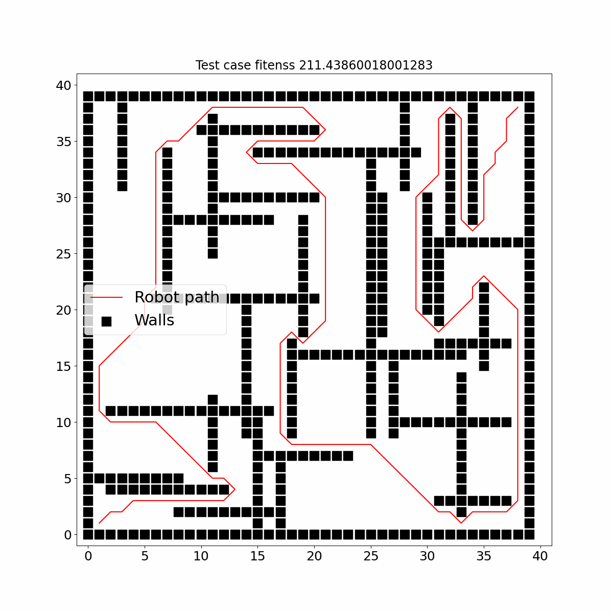
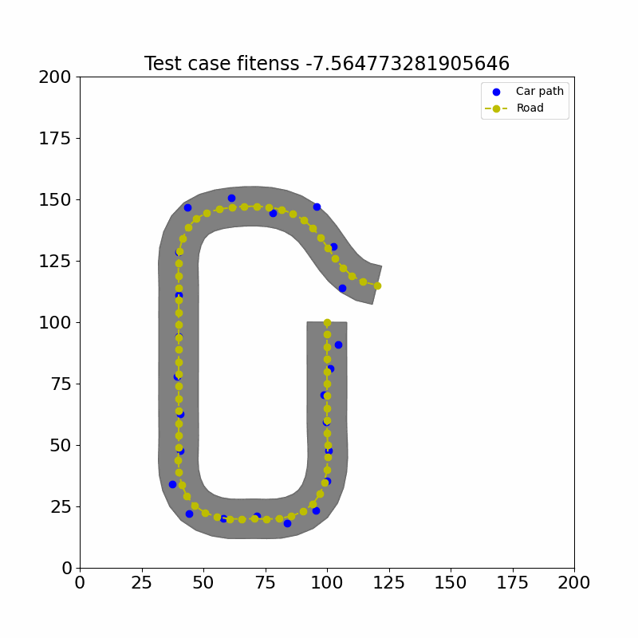
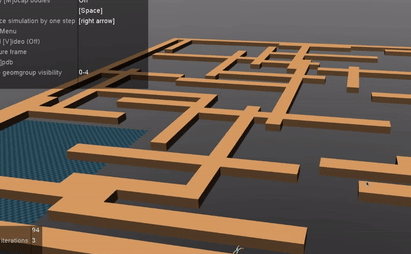
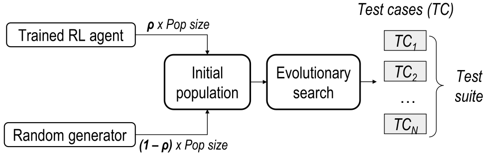

<!-- <p align="center">
	
    
</p> -->

<p float="center" align="center">
  
   
</p>

<p float="center" align="center">
  
   
</p>

<h1 align="center">
	Reinforcement learning Informed Genetic Algorithm for Autonomous systems testing (RIGAA)
</h1>

[](https://zenodo.org/badge/latestdoi/580930128)

<p align="center">
  <b>Current Tool Version: 0.1.0</b>
</p>

To improve the computational efficiency of the search-based testing, we propose augmenting the evolutionary
search (ES) with a reinforcement learning (RL) agent trained using surrogate rewards derived from domain
knowledge. In our approach, known as RIGAA (Reinforcement learning Informed Genetic Algorithm for
Autonomous systems testing), we first train an RL agent to learn useful constraints of the problem and then
use it to produce a certain percentage of the initial population of the search algorithm. By incorporating an RL
agent into the search process, we aim to guide the algorithm towards promising regions of the search space
from the start, enabling more efficient exploration of the solution space.
The diagram of the RIGAA approach is shown below. The *ρ* parameter corresponds to a proportion of RL generated solutions.

<p float="center" align="center">
   
</p>

You can see examples of some of the failures revealed by RIGAA in the following videos: [ant robot failures](https://youtu.be/eS25h7iLA1Q), [autonomous vehicle failures](https://youtu.be/zaTSuFrVrhw).
## Table of Contents
- <span style="font-size: x-large;"> [Usage](#usage)
  - <span style="font-size: x-large;"> [Search-based test scenario generation](#search-based-test-scenario-generation)
  - <span style="font-size: x-large;"> [Training RL agents for scenario generation](#training-RL-agents-for-scenario-generation)
- <span style="font-size: x-large;">[Simulator installation for Ant robot environment](#installation-instructions-to-run-the-ant-agent-in-mujoco-simulator-for-autonomous-robot-case-study)
- <span style="font-size: x-large;">[Simulator installation for autonomous vehicle environment](#installing-the-beamng-simulator-for-autonomous-vehicle-case-study)
- <span style="font-size: x-large;">[Results replication](#replication-package)
- <span style="font-size: x-large;">[Results processing](#result-processing)

## Citation
Please cite the following paper if you use this tool in your research:
```bibtex
@misc{humeniuk2023reinforcement,
      title={Reinforcement Learning Informed Evolutionary Search for Autonomous Systems Testing}, 
      author={Dmytro Humeniuk and Foutse Khomh and Giuliano Antoniol},
      year={2023},
      eprint={2308.12762},
      archivePrefix={arXiv},
      primaryClass={cs.RO}
}
```

## Usage
RIGAA tool can be used as a search-based test case generation tool, guided by a system behaviour in a simulator or by a surrogate (simplified) fitness function. We also provide scripts for traiinig and evaluating test generation RL agents.

To use the tool first, make sure your environment is with ``python>=3.7`` and install the requirements with:
```python
pip install -r requirements.txt
```

### Search-based test scenario generation

Currently the tool supports generating mazes for testig autonomous robotic systems (``robot`` problem) and road topologies for testing the autonomous lane-keeping assist systems (``vehicle`` problem).

To launch the tool, run the following command:
```python
python optimize.py --problem <problem> --algorithm <algorithm> --runs <number of runs> --save_results True --n_eval <number of evalautions> --seed <random_seed> --full False
```
For the explanation of the arguments, refer to the table below.
<center>

| Argument      | Description                      | Possible values |
| :-------------: |:-------------------------------: | :---------------:|
| problem      |test scenario generation problem | robot, vehicle (default=vehicle) |
| algorithm      | test sceanrio generation algorithm | rigaa, nsga2, random (default=nsga2) |
| runs | number of times to run the algorithm      |  An integer value (default=1) |
| save_results | whether to save run statistics and images     |  True, False (default=True) |
| seed | random seed value    |  An integer value (default=None), if no value is provided a random seed is generated automatically|
|debug | whether to add the debug data to the log file    |  True, False (default=False)|
|n_offsprings| number of offspring that are created through mating   |  By default n_offsprings=None which sets the number of offsprings equal to the population size |
|n_eval | number of evalautions (each generation ``n_offsprings`` solutions are evaluated)   |  If not  specified the ``eval_time`` or ``n_gen`` parameter will be used |
|eval_time | time to run the algorithm in the format "hours:minutes:seconds" e.g 1.5 h will be "01:30:00"    |  If not  specified the ``n_gen`` parameter from the config file will be used |
|full| whether to use a simulator for evaluation   | True, False (default=False)|


</center>

Here are the commands to run the tool for the robot and vehicle problems (when the simulator was used the ``full`` argument was set to ``True``):  

```python
python optimize.py --problem robot --algorithm rigaa --runs 30 --save_results True --n_eval 8000 --n_offsprings 100
```
```python
python optimize.py --problem vehicle --algorithm rigaa --runs 30 --save_results True --n_eval 65000 
```
For both problems we used ``150`` population size.
One run with this number of evaluatiions will take approximately 1 hour for both systems. To reduce the run time, you can reduce the number of evaluations (``n_eval``).

### Training RL agents for scenario generation

To train the RL agent for the robot problem, we used the following command:
```python 
python train.py --problem "robot" --save_path_name "run0" --num_steps 500000 --ent_coef 0.005
```
To train the RL agent for the vehicle problem, we used the following command:
```python 
python train.py --problem "vehicle" --save_path_name "run0" --num_steps 2500000 --ent_coef 0.005
```
To evaluate the agent, run the following command:
```python 
python evaluate.py --problem <problem> --save_path_name "run0" --model_path <trained_model_path>
```
where ``<trained_model_path>`` is the path to the .zip file containing the trained model, ``<problem>`` is the problem name (``robot`` or ``vehicle``).

## Installation instructions to run the ant agent in Mujoco simulator for autonomous robot case study

1. This installation was tested Ubuntu 20.04 LTS with python 3.8 or 3.9, with Pytroch with Cuda available. Running on Ubuntu virtual machine on Windows did not work.
2. Clone this repository to your machine. Then change the directory.

```
cd RIGAA_tool
```  
3. First install the dependencies needed to run the RIGAA tool
```
pip install -r requirements.txt
```  
3. Go to the d4rl folder.
```
cd d4rl
```
4. Install the dependencies for the d4rl project.
```
pip install -e .
```
5. In addition you also need to install pytorch library with cuda support (including torch and torchvision). The correct command to perform the installation can be found [here](https://pytorch.org/get-started/locally/).
6. You also need to set up the [mujoco simulator](https://github.com/openai/mujoco-py): download the MuJoCo version 2.1 binaries for
[Linux](https://mujoco.org/download/mujoco210-linux-x86_64.tar.gz) or
[OSX](https://mujoco.org/download/mujoco210-macos-x86_64.tar.gz).
Extract the downloaded `mujoco210` directory into `~/.mujoco/mujoco210`.
7. Install the requirements for *RLkit* library:
```
cd rlkit-offline-rl-benchmark
pip install -e .
```
8. Add following line to .bashrc changing *your_path* accordingly:
```
export LD_LIBRARY_PATH=$LD_LIBRARY_PATH:/your_path/.mujoco/mujoco210/bin
```
9. At this point you should be able to run the simulator guided search search for the ``robot`` problem. To do so, and run the search for 2 hours run the following command:
```python
python optimize.py --problem robot --algorithm rigaa --runs 30 --save_results True --eval_time "02:00:00" --full True
```
10. The provided installation instructions were based on the one provided in the D4RL repository. For more details, please refer to the [D4RL repository](https://github.com/Farama-Foundation/D4RL).

## Installing the BeamNG simulator for autonomous vehicle case study
The provided installation instructions are based on the instructions that can be found in the [SBFT CPS tool competition repository](https://github.com/sbft-cps-tool-competition/cps-tool-competition/blob/main/documentation/INSTALL.md).

1. This tool needs the BeamNG simulator to be installed on the machine where it is running. A free version of the BeamNG simulator for research purposes can be obtained by registering at https://register.beamng.tech and following the instructions provided by BeamNG. 
> **Note**: As stated on the BeamNG registration page, please use your university email address. 

2. Fill the "Application Text" field of the registration form with the following text:
```
I would like to run experiments in the BeamNG simulator as a part of my research project and for that I need to a
copy of BeamNG.tech
```

For our experiments we used `BeamNG.tech v0.26.2.0`, please make sure you download exactly this version of the simulator, i.e., file `BeamNG.tech.v0.26.2.0.zip`.

3. Installing BeamNG.tech is as simple as extracting the files to a target folder in your system (e.g., `C:\BeamNG.tech.v0.26.2.0`). We call this folder `<BEAMNG_HOME>`. Additionally you need to create another folder (e.g., `C:\BeamNG.tech.v0.26.2.0_userpath`) that will act as BeamNG.tech working dir. BeamNG.tech will copy in this directory the levels and its cache. We call this folder `<BEAMNG_USER>`.

Copy the tech.key file that you received after registering inside the <BEAMNG_USER> folder.

> NOTE: Make sure that `<BEAMNG_HOME>` and `<BEAMNG_USER>` contain no spaces nor special characters. 

> NOTE: Please use different folders for `<BEAMNG_HOME>` and `<BEAMNG_USER>`.

> NOTE: Our pipeline supports also the previous simulator version, i.e., `BeamNG.tech v0.26.1.0`. 


4. Enter the `<BEAMNG_HOME>` and `<BEAMNG_USER>`paths to the [vehicle_problem.py](rigaa/problems/vehicle_problem.py) file, specifically ```VehicleProblem2Obj``` class.
```python
        self.executor = BeamngExecutor(
            res_path,
            cf.vehicle_env["map_size"],
            time_budget=8000,
            beamng_home="",
            beamng_user="",
            road_visualizer=None,
        )
```
Here are examples of the paths: ```beamng_home="...\\Documents\\BeamNG.tech.v0.26",
            beamng_user="...\\Documents\\BeamNG.tech.v0.26_user".```

5. At this point you should be able to run the simulator guided search search for the ``vehicle`` problem. To do so, run the following command to run the search algorithm for 2 hours:
```python
python optimize.py --problem vehicle --algorithm rigaa --runs 30 --save_results True --eval_time "02:00:00" --full True
```

## Replication package

Below we provide the instrucions on how to replicate the results presented in each RQ of the paper.

### RQ1: *Comparing the performance of the RL-based test generator and random test generator*

For comparing random and RL-based test generator for autonomous robot problem, we used the following commands (to use the simulator for comparison use the ``full`` argument):
```python
python compare_generators.py --problem <problem> --runs 30 --tc_num 30
```

```python
python compare_generators.py --problem <problem> --runs 10 --tc_num 30 --full True
```
The script will generate the file with the statistics in terms of fitness and diversity of the generated test scenarios with random and RL based generators.
The obtained results are stored in the [``results/RQ1``](/results/RQ1) folder.  
To visualize the results (i.e. obtain the boxplots as well as the tables with statistical tests) run the following command with the ``compare.py`` script:

```python
python compare.py  --stats_path "/results/RQ1/09-03-2023_stats_random_gen_vehicle" "results/RQ1/09-03-2023_stats_rl_gen_vehicle" --stats_names "Random" "RL agent" --plot_name "rq1_vehicle_full"
```
where ``stats_names`` and ``plot-name`` can be chosen arbitrary and are only used for visualisation and storage.

### RQ2: *Selecting the *ρ* hyperparameter of the RIGAA algorithm*

To replicate the data we obtained in our experiments, run the following command:
```python
python optimize.py --problem <problem> --algorithm "rigaa" --runs 30 --n_eval <eval_num> --ro <ρ value>
```
For the ``<problem>`` you can specify either ``robot`` or ``vehicle``, for the ``ρ`` we used the following values: *0.2, 0.4, 0.6, 0.8, 1*. For the ``robot`` problem the ``<eval_num>`` was 8000 and for the ``vehicle`` 65000.

To build the fitness, diversity and convergence plots as well as obtain statistical testing results, run the following command:
```python
python compare.py --stats_path "results/RQ2/robot/07-02-2023_stats2_rigaa_robot" "results/RQ2/robot/08-02-2023_stats_04_rigaa_robot" "results/RQ2/robot/08-02-2023_stats_06_rigaa_robot/" "results/RQ2/robot/08-02-2023_stats_08_rigaa_robot/" "results/RQ2/robot/08-02-2023_stats_1_rigaa_robot/" --stats_names "0.2" "0.4" "0.6" "0.8" "1" --plot_name "rq2_robot"
```
You can use an analogical command to process the results for the vehicle problem using the results for the [vehicle problem](results/RQ2/vehicle/).

### RQ3: *Comparing RIGAA and randomly initialized MOEA*
To replicate the data we obtained in our experiments, run the following command:
```python
python optimize.py --problem <problem> --algorithm <algorithm> --runs 30 --n_eval <eval_num>
```
For the ``<problem>`` you can specify either ``robot`` or ``vehicle``, for the ``<algorithm>`` we used the following values: *``"random"``, ``"nsga2"``, ``"smsemoa"``, ``"rigaa"`` and ``"rigaa_s"``*. For the ``robot`` problem the ``<eval_num>`` was 8000 and for the ``vehicle`` 65000.

To build the fitness, diversity and convergence plots as well as obtain statistical testing results, run the following command:

```python
python compare.py --stats_path "results/RQ3/robot/08-02-2023_stats_random_robot" "results/RQ3/robot/07-02-2023_stats2_nsga2_robot" "results/RQ3/robot/31-03-2023_stats_smsemoa_robot" "results/RQ3/robot/07-02-2023_stats2_rigaa_robot" "results/RQ3/robot/31-03-2023_stats_rigaa_s_robot" --stats_names "Random" "NSGA-II" "SMSEMOA" "RIGAA" "RIGAA_S" --plot_name "rq3_robot"
```
You can use an analogical command to process the results for the vehicle problem.

### RQ4: *Usefulness of RIGAA for simulator-based testing of autonomous robotic systems*

To replicate the data we obtained in our experiments, run the following command:
```python
python optimize.py --problem <problem> --algorithm <algorithm> --runs 30 --eval_time "02:00:00" --full True
```
For the ``<problem>`` you can specify either ``robot`` or ``vehicle``, for the ``<algorithm>`` we used the following values: *``"random"``, ``"nsga2"``,  ``"rigaa"`` (with ρ=0.4)*. 

For the comparing the performace of the lane-keeping assist system (LKAS) testing tools, such as AmbieGen, Frenetic and RIGAA we used the pipeline provided by the [SBST 2022 tool competition](https://github.com/se2p/tool-competition-av).  

To build the fitness, diversity and convergence plots as well as obtain statistical testing results, run the following command for comparing RIGAA to random search and NSGA-II:

```python
python compare.py --stats_path "results/RQ4/robot/04-03-2023_stats_fit_random_robot" "results/RQ4/robot/04-03-2023_stats_fit_nsga2_robot" "results/RQ4/robot/05-03-2023_fit_rigaa_robot" --stats_names "Random" "NSGA2" "RIGAA" --plot_name "rq4_robot"
```
(For the vehicle problem use the results from the [``results/RQ4/vehicle``](/results/RQ4/vehicle) folder.

To visulalize the results for the LKAS testing tools, run the following command:
```python
python compare.py --stats_path "results/RQ4/vehicle/results_rigaa_2h/" "results/RQ4/vehicle/results_ambiegen_2h/" "/results/RQ4/vehicle/results_frenetic_2h/" --stats_names "RIGAA" "AmbieGen" "Frenetic" --plot_name "rq4_tools" --tools
```

## Results processing

After the RIGAA tool run, the experiment metadata, such as the fitness and diversity of the solutions, the best solution found at each generation, the final test scenarios specifications as well as the illustations of the scenarios are saved into the corresponding folders, with the name of the folder starting with a current date.

The obtained folders can be directly passed to the ``compare.py`` script to obtain the boxplots and statistical tests.

To re-execute the saved test cases in the simulator (in the .json files containing the name ``tcs``) use the following command:
```python
python play_scenario.py --problem <problem> --scenario_path <tcs_file_path> --run <run_num>
```
where ``<problem>`` can be either ``robot`` or ``vehicle``, ``<tcs_file_path>`` is the path to the .json file containing the test cases and ``<run_num>`` is the number of the run for which the test cases should be executed.

## Contributing
Bug reports and pull requests are welcome. If you have any questions, please contact me at dmytro.humeniuk@polymtl.ca.

## License
This code is available as open source under the terms of the [MIT License](https://opensource.org/licenses/MIT).  